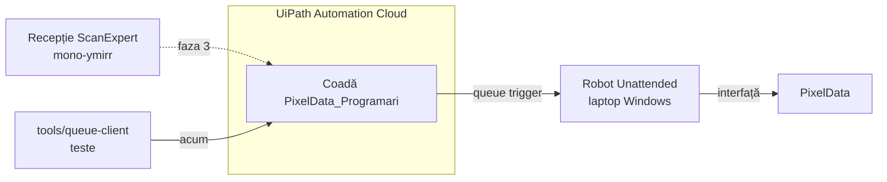

# pixeldata-programari-rpa

Robot UiPath care introduce în PixelData, RIS-ul desktop pe Windows al clinicii, programările create în recepția ScanExpert. O programare salvată în recepție intră într-o coadă UiPath Orchestrator; un robot Unattended de pe un laptop Windows o preia și completează fișa în PixelData prin interfață, ca un operator, fiindcă PixelData nu are o specificație publică de import (investigatie §4 „PixelData”). Scopul: programarea ajunge automat în PixelData, fără Excel manual (investigatie §1). Acum se lucrează pe Linux, fără Windows și fără UiPath Studio; robotul se construiește și rulează pe laptop.

## Pe scurt



Detalii: [docs/01-arhitectura.md](docs/01-arhitectura.md).

## Faze

| Faza | Unde | Conținut | Stare |
|---|---|---|---|
| 1 | Linux | documentație, contract + exemple + validator, `tools/queue-client`, `robot/Logic` + teste scrise | în lucru |
| 2 | laptop Windows + Orchestrator | setup, proiect REFramework în Studio, captură UI PixelData, XAML, `dotnet test`, test end-to-end cu `queue-client` | neînceput |
| 3 | mono-ymirr, recepția | outbox + dispatcher + status înapoi | doar design ([docs/05](docs/05-integrare-receptie.md)) |
| 4 | — | anulare, mutare, auto-anulare; HL7 dacă PixelData acceptă | neplanificat |

În `docs/sources/` integrarea recepției apare ca „faza 2”; restul documentației folosește numerotarea de mai sus.

## Structura

```text
.
├── README.md
├── docs/
│   ├── 01-arhitectura.md … 11-intrebari-deschise.md
│   └── sources/                      input înghețat, nu se editează
├── contracts/
│   ├── appointment-queue-item.v1.schema.json   SpecificContent-ul itemului
│   ├── queue-item-output.v1.schema.json        Output-ul setat de robot
│   ├── examples/
│   │   ├── valid/
│   │   └── invalid/
│   │       ├── schema/               pică validarea schemei
│   │       └── business/             trec schema, robotul le refuză
│   ├── validate_examples.py
│   └── README.md
├── robot/
│   ├── Logic/*.cs                    C# pur, copiat în proiectul Studio
│   ├── Data/pixeldata-mappings.json  valori PixelData: resurse, sursă pacient, proceduri
│   ├── Config.rows.csv               rânduri pentru Config.xlsx (REFramework)
│   └── WORKFLOWS.md
├── tests/
│   └── Logic.Tests/                  xunit pe robot/Logic, rulează pe laptop
└── tools/
    └── queue-client/                 client Go (stdlib) pentru Orchestrator
```

## Documentație

| Doc | Conținut |
|---|---|
| [01](docs/01-arhitectura.md) | componente, flux, stările itemului, ce rulează unde, decizii de design |
| [02](docs/02-flux-pixeldata.md) | pașii robotului în PixelData |
| [03](docs/03-contract-coada.md) | contractul itemului v1: chei, Reference, Output, coduri de eroare, versionare |
| [04](docs/04-mapare-campuri.md) | câmp PixelData ↔ cheie contract ↔ sursă în recepție; goluri |
| [05](docs/05-integrare-receptie.md) | faza 3, design: outbox, dispatcher, status înapoi |
| [06](docs/06-setup-orchestrator.md) | configurarea Orchestrator: folder, coadă, trigger, assets, aplicație externă |
| [07](docs/07-setup-laptop.md) | pregătirea laptopului: Windows, cont robot, instalare, conectare |
| [08](docs/08-construire-in-studio.md) | construirea procesului în Studio |
| [09](docs/09-licente-gdpr-riscuri.md) | licențe UiPath, GDPR, condiții PixelData, riscuri, alternativa HL7 |
| [10](docs/10-plan-teste.md) | planul de teste |
| [11](docs/11-intrebari-deschise.md) | întrebări deschise, pe destinatari |

## Pe laptop, în ordine

[docs/07](docs/07-setup-laptop.md) → [docs/06](docs/06-setup-orchestrator.md) → [docs/08](docs/08-construire-in-studio.md) → [docs/10](docs/10-plan-teste.md)

## Reguli

| Regulă | Detaliu |
|---|---|
| Fără secrete | substituenți `{org}`, `{tenant}`, `<client-id>`; secretele stau în Orchestrator sau în seif, niciodată în repo |
| Fără date reale de pacienți | exemple, teste și capturi folosesc doar date fictive |
| `docs/sources/` | input înghețat; corecturile intră în documentele din `docs/` |
