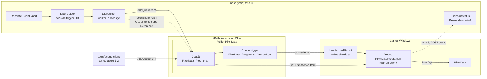
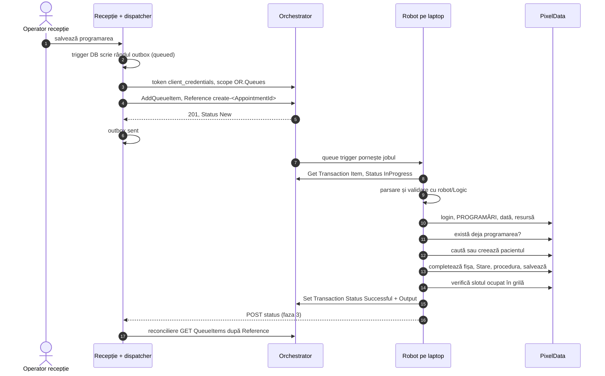
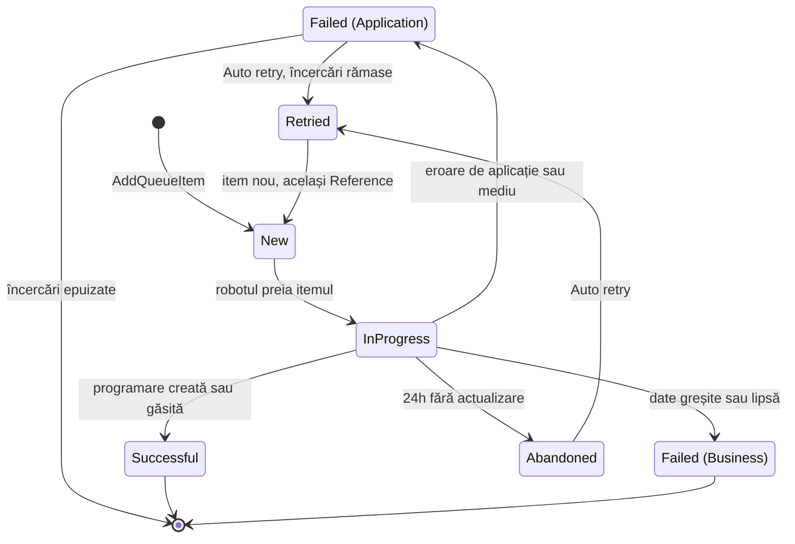

# 01 — Arhitectura

Cum ajunge o programare din recepția ScanExpert în PixelData. Pașii din PixelData: [02](02-flux-pixeldata.md). Contractul itemului: [03](03-contract-coada.md).

## 1. Context

| Componentă | Rol | Detalii |
|---|---|---|
| Recepția ScanExpert | creează programarea; din faza 3 o pune în coadă și primește statusul | [05](05-integrare-receptie.md) |
| `tools/queue-client` | pune itemi de test în coadă, în fazele 1–2 | [`tools/queue-client/`](../tools/queue-client/) |
| Orchestrator, folder `PixelData` | coada `PixelData_Programari`, triggerul `PixelData_Programari_OnNewItem`, procesul `PixelDataProgramari`, assetul `PixelData_RobotLogin` | [06](06-setup-orchestrator.md) |
| Laptop Windows | cont local `robot-pixeldata`, Unattended Robot pe machine template `PixelData-Laptop`, PixelData | [07](07-setup-laptop.md) |
| Proces `PixelDataProgramari` | REFramework: ia itemul, validează cu `robot/Logic`, completează PixelData, setează statusul | [08](08-construire-in-studio.md) |

## 2. Fluxul fericit

| Situație | Diferență |
|---|---|
| Fazele 1–2 | nu există pașii 1, 2, 6, 16, 17; pașii 3–5 îi face `tools/queue-client` |
| Programarea există deja la pasul 11 | pașii 12–14 se sar; `Outcome` = `already_existed` |
| Orice abatere | excepție Business sau System; codurile în [03](03-contract-coada.md) |

## 3. Stările unui item din coadă

| Status | Înseamnă | Urmează |
|---|---|---|
| New | item adăugat, sau clona creată de un retry | așteaptă robotul; nu expiră cât laptopul e oprit |
| InProgress | preluat de robot | 24h fără actualizare ⇒ Abandoned; itemul nu e reluat automat după o cădere |
| Successful | programarea există în PixelData, creată acum sau găsită | `Output` ([03](03-contract-coada.md)) |
| Failed, Business | date greșite sau lipsă, ex. `CNP_INVALID` | fără retry; un om corectează sursa; retrimiterea e deschisă ([11](11-intrebari-deschise.md) U7, S8) |
| Failed, Application | aplicație sau mediu, ex. `PIXELDATA_UI_TIMEOUT` | Auto retry, maximum 1 încercare (setarea cozii) |
| Abandoned | InProgress 24h, ex. laptop căzut în timpul jobului | retry doar cu Auto retry |
| Retried | itemul original, după retry | clona are același `Reference`; itemul actual e cel cu `Id` maxim |

Surse: investigatie §4 „Retry în coadă”, „Status”, „Cădere în mijlocul unui job”; decizii „Nume convenite”.

## 4. Ce rulează unde

| Loc | Ce | Faza |
|---|---|---|
| Linux, dezvoltare | documentație; `contracts/` + `validate_examples.py`; `tools/queue-client` (Go); `robot/Logic` și `tests/Logic.Tests` scrise, necompilate (fără .NET SDK) | 1 |
| UiPath Automation Cloud | Identity (token); Orchestrator: folder, coadă, trigger, proces, assets, machine template, aplicația externă `ScanExpert-Receptie-Dispatcher` | 2 |
| Laptop Windows | Studio, Unattended Robot, PixelData, procesul publicat; `dotnet test` pentru `tests/Logic.Tests` | 2 |
| mono-ymirr, recepția (k8s, namespace `scanexpert-dev`) | trigger DB + outbox, dispatcher, endpoint de status | 3 |

## 5. Decizii de design

| # | Decizie | De ce | Respins |
|---|---|---|---|
| D1 | Coadă Orchestrator + queue trigger | coada deduplică după `Reference`, reîncearcă erorile de aplicație și păstrează itemii cât laptopul e oprit; triggerul pornește jobul la item nou și reverifică la 30 min | API Trigger, HTTP Webhook din Integration Service, StartJobs: fără deduplicare, fără retry (investigatie §4 „Declanșare din backend”) |
| D2 | `Reference` unic `create-<AppointmentId>`, coadă cu „Enforce unique references” | trimiterea e idempotentă: a doua trimitere e respinsă ca duplicat și tratată ca reușită; prefixul lasă loc altor operații în v2 | Reference aleator: dublură la fiecare retrimitere a emitentului |
| D3 | „Maximum pending and running jobs” = 1 | un laptop, o sesiune Windows, o instanță PixelData; două joburi s-ar bate pe aceeași interfață | joburi paralele |
| D4 | Verificare idempotentă „există deja programarea?” (CNP + dată + oră + resursă) înainte de creare | un job căzut la salvare lasă programarea pe jumătate; retry-ul ar crea dublură; găsită ⇒ `already_existed` | încredere doar în statusul itemului |
| D5 | Contract plat: chei plate, mereu prezente, `""` = necunoscut, chei necunoscute ignorate | în Studio `SpecificContent` e un dicționar cheie → valoare; robotul nu ramifică pe „cheie lipsă”; emitentul poate adăuga chei fără să strice robotul | obiecte imbricate (pacient, bilet): parsare JSON în XAML |
| D6 | Datele complete ale programării în item | robotul nu depinde de recepție la rulare (decizia utilizatorului, investigatie §1) | doar `AppointmentId`; costul GDPR al alegerii în [09](09-licente-gdpr-riscuri.md) |
| D7 | Logica în C# pur (`robot/Logic`), fără `using UiPath` | parsarea, CNP-ul, numele, mapările și validarea se testează cu xunit, fără Studio; XAML rămâne subțire | logică în XAML: netestabilă în afara Studio |
| D8 | Proiectul de teste în afara folderului proiectului UiPath | Studio compilează toate `.cs` din folderul proiectului (investigatie §4 „Proiect și scrierea codului”) | teste în proiectul Studio |
| D9 | Împărțire Linux / laptop | pe Linux lipsesc Windows, Studio și .NET SDK; `uip rpa build` cere Windows; `project.json` și XAML scrise de mână sunt nerecomandate, scheletul se generează în Studio | tot pe laptop: nimic nu avansează până la laptop |
| D10 | Erori Business fără retry, System cu retry | o dată greșită rămâne greșită la a doua încercare; o fereastră care n-a apărut poate apărea | retry pentru tot |
| D11 | Status înapoi: callback HTTP de la robot + reconciliere după `Reference` | callback-ul e rapid; reconcilierea prinde callback-urile pierdute | doar Webhooks Orchestrator: pierd evenimente (investigatie §4) |
| D12 | Valorile PixelData în `robot/Data/pixeldata-mappings.json` | valorile reale se află doar din PixelData, pe laptop; `"TODO"` = lipsă ([04](04-mapare-campuri.md)) | valori scrise în cod |
