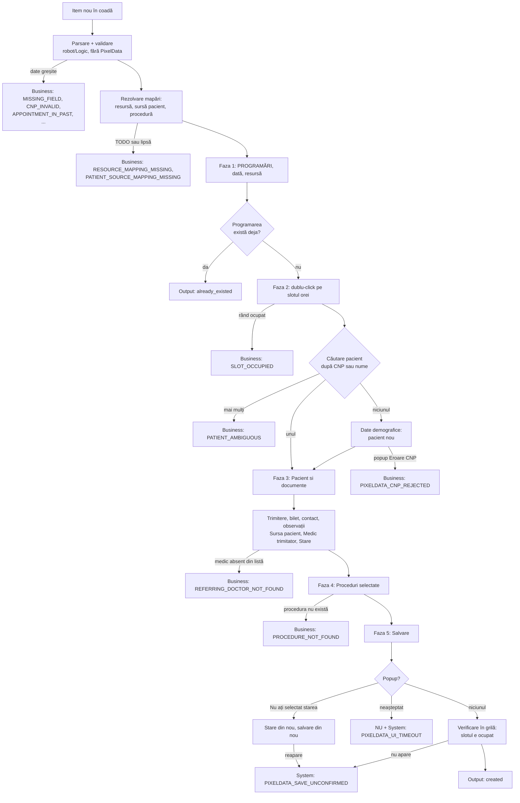

# 02 — Fluxul robotului în PixelData

Fluxul operatorului uman din [`sources/flux-programare-pixeldata.original.md`](sources/flux-programare-pixeldata.original.md), fazele 1–5, tradus în pașii robotului: ce element atinge, cu ce activitate, din ce cheie a contractului, ce verifică și ce cod de eroare dă când nu merge.

Workflow-urile, argumentele lor și elementele de capturat: [`robot/WORKFLOWS.md`](../robot/WORKFLOWS.md). Construcția în Studio: [08](08-construire-in-studio.md). Cheile contractului: [03](03-contract-coada.md). Câmp PixelData ↔ cheie ↔ sursă în recepție: [04](04-mapare-campuri.md).

Fluxul original a fost dedus dintr-un clip cu aplicația. Nimic nu a fost rulat pe PixelData: numele elementelor și mecanismele marcate „(de verificat)” se confirmă pe laptop.

## 1. Diagrama

Orice pas care atinge interfața poate da `PIXELDATA_UI_TIMEOUT` (system) când un ecran sau un element nu apare la timp; diagrama nu repetă asta la fiecare cutie.

## 2. Pașii

`Activitate` = activitatea UiPath. `Cheie` = cheia din `SpecificContent` ([03](03-contract-coada.md)). Tip: **B** = business, itemul nu se reîncearcă; **S** = system, coada reîncearcă o dată.

### Înainte de PixelData

| # | Pas | Activitate | Cheie folosită | Verificare | Cod la eșec | Tip |
|---|---|---|---|---|---|---|
| 0.1 | parsarea itemului | `QueueItemParser.FromSpecificContent` | toate | chei prezente, tipuri și formate corecte | `MISSING_FIELD`, `INVALID_FIELD`, `UNSUPPORTED_SCHEMA_VERSION`, `UNSUPPORTED_OPERATION` | B |
| 0.2 | validarea regulilor | `AppointmentValidator.EnsureValid` | `ProductName`, `PatientFullName`, `BranchName`, `PatientCnp`, `ScheduledAt`, `Payer`, `Insurer` | câmpuri obligatorii ne-goale; CNP valid; ora în viitor, peste toleranță | `MISSING_FIELD`, `CNP_REQUIRED`, `CNP_INVALID`, `APPOINTMENT_IN_PAST` | B |
| 0.3 | resursa PixelData | `PixelDataMappings.ResolveResource` | `BranchName`, `Modality` | rând în `resources`, valoare ≠ `TODO` | `RESOURCE_MAPPING_MISSING` | B |
| 0.4 | sursa pacientului | `PixelDataMappings.ResolvePatientSource` | `ReferringDoctorClinic` | alias sau `fallback`, valoare ≠ `TODO` | `PATIENT_SOURCE_MAPPING_MISSING` | B |
| 0.5 | procedura | `PixelDataMappings.ResolveProcedure` | `ProductCode`, `ProductName` | nu aruncă: fără mapare se folosește `ProductName` | — | — |
| 0.6 | nume și prenume | `NameSplitter.Split` | `PatientFullName`, `PatientLastName`, `PatientFirstName` | primul cuvânt = `Nume`, restul = `Prenume` | — | — |

Pașii 0.1–0.6 nu ating PixelData. Un item greșit se oprește aici, fără să deschidă nimic și fără să ocupe un slot.

### Faza 1 — calendarul și resursa

| # | Pas | Element PixelData | Activitate | Cheie | Verificare | Cod la eșec | Tip |
|---|---|---|---|---|---|---|---|
| 1.1 | pornire și login | fereastra de login | `Use Application/Browser`, `Type Into`, `Type Secure Text`, `Click` | — (asset `PixelData_RobotLogin`) | apare fereastra principală | `PIXELDATA_UNAVAILABLE`, `PIXELDATA_LOGIN_FAILED` | S |
| 1.2 | modulul principal | `PROGRAMĂRI`, panoul vertical din stânga | `Click` | — | apare mini-calendarul | `PIXELDATA_UI_TIMEOUT` | S |
| 1.3 | data | mini-calendar (stânga-sus) | `Get Text` pe antetul lunii, `Click` pe lună și pe zi | `ScheduledLocalDate` | ziua selectată e cea cerută | `PIXELDATA_UI_TIMEOUT` | S |
| 1.4 | resursa | drop-down lângă calendar: resursa, cabinetul sau medicul (exemplul din clip) | `Select Item`, apoi `Get Text` | `BranchName` + `Modality` prin mapări | valoarea rămâne selectată | `PIXELDATA_UI_TIMEOUT`; valoarea mapată nu e în listă: `RESOURCE_MAPPING_MISSING` | S / B |
| 1.5 | programarea există deja? | grila zilei | `Extract Table Data` | `ScheduledLocalTime`, `PatientFullName` | rând cu aceeași oră și același pacient | `PIXELDATA_UI_TIMEOUT` | S |

Pasul 1.5 nu e în fluxul original: un operator uman vede imediat dacă a introdus deja programarea. Robotul nu vede, iar un job căzut între salvare și confirmare ar duce la o programare dublă la retry (decizia D4 din [01](01-arhitectura.md)). Găsit ⇒ `Outcome` = `already_existed`, restul pașilor se sar.

### Faza 2 — slotul orar

| # | Pas | Element PixelData | Activitate | Cheie | Verificare | Cod la eșec | Tip |
|---|---|---|---|---|---|---|---|
| 2.1 | citirea grilei | tabelul zilei: `Ora`, `Nume`, `Observatii`, `Contact`, `Serviciu` | `Extract Table Data` (varianta 1); Computer Vision sau text + ancoră (2); tastatură, săgeți + `Enter` (3) | `ScheduledLocalTime` | rândul orei există | `PIXELDATA_UI_TIMEOUT` | S |
| 2.2 | slotul e liber? | coloana `Nume` pe rândul orei | comparație în memorie | — | `Nume` gol | `SLOT_OCCUPIED` | B |
| 2.3 | deschiderea fișei | rândul gol al orei | `Double Click` | — | apare sub-tab-ul `Pacient si documente` | `PIXELDATA_UI_TIMEOUT` | S |

Ordinea 1 → 2 → 3 pentru alegerea slotului e cea din investigatie §4: se folosește prima variantă care merge pe laptop. Variantele 2 și 3 depind de rezoluție și scalare, care trebuie să fie aceleași la captură și la rulare ([07](07-setup-laptop.md) §4).

### Faza 3 — „Pacient si documente”

| # | Pas | Element PixelData | Activitate | Cheie | Verificare | Cod la eșec | Tip |
|---|---|---|---|---|---|---|---|
| 3.1 | căutarea pacientului | `Nume/CNP` | `Type Into` + `Enter` | `PatientCnp`, altfel `PatientFullName` | exact un rezultat | mai multe: `PATIENT_AMBIGUOUS` | B |
| 3.2 | pacient nou: deschiderea profilului | `Date demografice`, meniul din stânga | `Click` | — | apare formularul | `PIXELDATA_UI_TIMEOUT` | S |
| 3.3 | pacient nou: datele | `Nume`, `Prenume`, `CNP` | `Type Into` | `PatientLastName`, `PatientFirstName`, `PatientCnp` (după `NameSplitter`) | nu apare fereastra `Eroare` | `PIXELDATA_CNP_REJECTED` | B |
| 3.4 | trimitere | checkbox `Trimitere` | `Check` | derivat din `Payer` (`CAS`, `Monitor` ⇒ bifat) | starea checkbox-ului | `PIXELDATA_UI_TIMEOUT` | S |
| 3.5 | numărul biletului | `Nr./Serie bilet` | `Type Into` | `ReferralNumber` | în v1 cheia e mereu `""`, deci pasul nu rulează (gol G2 în [04](04-mapare-campuri.md)) | — | — |
| 3.6 | data biletului | `Data bilet` | `Type Into` | `ReferralDate` | completat doar când nu e gol; formatul datei: de verificat | `PIXELDATA_UI_TIMEOUT` | S |
| 3.7 | telefon | câmpul de contact din fișă (de aflat pe laptop) | `Type Into` | `PatientPhone` | — | `PIXELDATA_UI_TIMEOUT` | S |
| 3.8 | observații | `Observatii` | `Type Into` | `Notes` | — | `PIXELDATA_UI_TIMEOUT` | S |
| 3.9 | sursa pacientului | `Sursa pacient:` | `Select Item` + `Get Text` | derivat din `ReferringDoctorClinic` prin mapări | valoarea rămâne selectată | valoarea mapată nu e în listă: `PATIENT_SOURCE_MAPPING_MISSING` | B |
| 3.10 | medicul trimițător | `Medic trimitator:` | `Select Item` + `Get Text` | `ReferringDoctorName` | nume gol ⇒ câmpul nu se atinge, nu e eroare | nume ne-gol, absent din listă: `REFERRING_DOCTOR_NOT_FOUND` | B |
| 3.11 | starea | `Stare:` | `Select Item` + `Get Text` | `initialStatus` din mapări (`Programat`) | valoarea rămâne selectată | `PIXELDATA_UI_TIMEOUT` | S |

Pasul 3.11 este regula critică din fluxul original: fără `Stare:` salvarea e blocată de popup-ul `Atenție` / „Nu ați selectat starea pacientului!”. Robotul setează starea înainte de salvare și verifică imediat, ca să nu descopere lipsa din popup.

Pasul 3.10 e codul nou `REFERRING_DOCTOR_NOT_FOUND`: recepția poate avea un medic pe care PixelData nu îl cunoaște. E business, fiindcă un retry cu aceleași date eșuează la fel — trebuie corectate datele, nu repetată acțiunea (gol G9, întrebarea C11 în [04](04-mapare-campuri.md)).

### Faza 4 — procedurile

| # | Pas | Element PixelData | Activitate | Cheie | Verificare | Cod la eșec | Tip |
|---|---|---|---|---|---|---|---|
| 4.1 | căutarea serviciului | căutarea de proceduri | `Type Into` | `ProductCode` → mapare, altfel `ProductName` | procedura apare în listă | `PROCEDURE_NOT_FOUND` | B |
| 4.2 | adăugarea | lista de proceduri | `Click` | — | — | `PIXELDATA_UI_TIMEOUT` | S |
| 4.3 | confirmarea | `Proceduri selectate:` — `Cod`, `Denumire`, `Cantitate` | `Extract Table Data` | — | un rând cu denumirea cerută și cantitatea 1 | `PIXELDATA_UI_TIMEOUT` | S |

`PROCEDURE_NOT_FOUND` este al doilea cod nou. Acoperă și codul mapat greșit, și numele de produs din recepție care nu e denumirea din PixelData; ambele se repară în `robot/Data/pixeldata-mappings.json`, nu prin retry. V1 adaugă o singură procedură: o programare din recepție are un singur produs (gol G11). Prețul nu se completează.

### Faza 5 — salvarea și confirmarea

| # | Pas | Element PixelData | Activitate | Cheie | Verificare | Cod la eșec | Tip |
|---|---|---|---|---|---|---|---|
| 5.1 | salvarea | butonul de salvare / confirmare | `Click` | — | — | `PIXELDATA_UI_TIMEOUT` | S |
| 5.2 | popup-uri | ferestrele de mai jos | `Check App State` | — | niciun popup neașteptat | vezi §3 | B / S |
| 5.3 | confirmarea în grilă | grila `PROGRAMĂRI` | `Extract Table Data` | `ScheduledLocalTime`, `PatientFullName` | slotul e ocupat, afișează pacientul și serviciul | `PIXELDATA_SAVE_UNCONFIRMED` | S |
| 5.4 | output | — | `Set Transaction Status` (Successful) | `TransactionOutput.Success` | `Outcome`, `PatientCreated`, `PixelDataResource`, `ProcessedAt` | — | — |

Pasul 5.3 e cel care spune dacă programarea chiar există. `Successful` în Orchestrator înseamnă doar că robotul a terminat fără excepție.

## 3. Ferestrele pop-up

| Fereastră | Text | Ce face robotul | Cod | Tip |
|---|---|---|---|---|
| `Eroare` | „Eroare CNP pacient! CNP incorect. Căutarea returnează eroare” | închide fereastra | `PIXELDATA_CNP_REJECTED` | B |
| `Atenție` | „Nu ați selectat starea pacientului!” | `Închide`, setează `Stare:` din nou, salvează din nou; dacă reapare, se oprește | `PIXELDATA_SAVE_UNCONFIRMED` | S |
| `Atenționare` | „Sunteți sigur că doriți eliminarea fișei și revenirea la starea generată?” | `NU` | `PIXELDATA_UI_TIMEOUT` | S |
| `Atenție` | „Sunteți sigur că doriți golirea câmpurilor?” | `NU` | `PIXELDATA_UI_TIMEOUT` | S |
| altă fereastră modală | — | screenshot, nu apasă nimic | `PIXELDATA_UI_TIMEOUT` | S |

Ultimele trei sunt ferestre pe care robotul nu are de ce să le provoace: el nu anulează și nu golește nimic. Apariția lor înseamnă o stare pe care robotul nu o cunoaște. Răspunsul e mereu `NU` — nimic nu se pierde — urmat de o excepție de sistem; la reîncercare, pasul 1.5 decide dacă mai e ceva de creat. Pe `DA` nu se apasă niciodată.

## 4. Ce nu face robotul în v1

| Nu face | De ce |
|---|---|
| nu anulează și nu mută o programare | contractul v1 acceptă doar `Operation` = `"create"` ([03](03-contract-coada.md) §7) |
| nu adaugă o a doua procedură | o programare din recepție are un singur produs (gol G11) |
| nu completează prețul | prețurile pe contract stau în PixelData |
| nu scrie lateralitatea și asigurătorul privat | nu au câmp cunoscut în fișă (gol G10) |
| nu creează medici sau clinici | golurile G9 și G3; robotul alege doar din listele existente |
| nu apasă `DA` pe nicio fereastră de confirmare | singurele două cunoscute șterg date |
