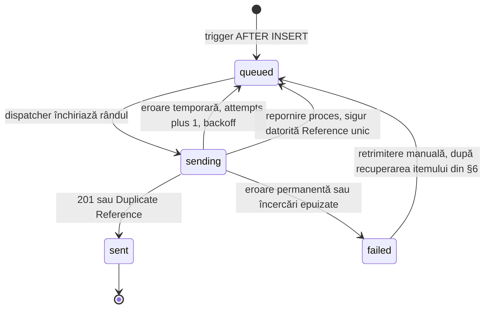
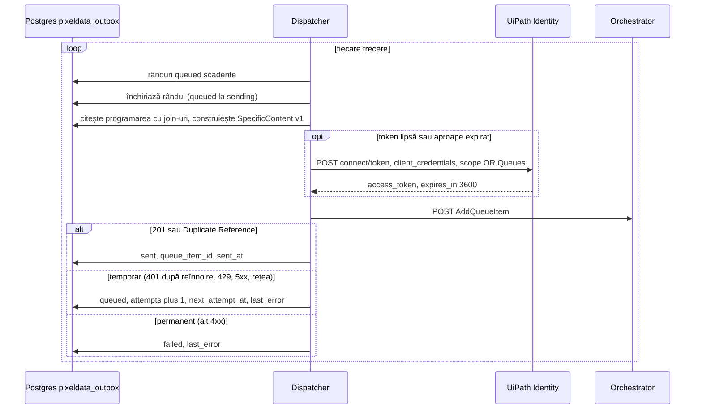

# 05 — Integrarea cu recepția (faza 3, design)

> Doar design. mono-ymirr nu se modifică în această fază (investigatie §1). Implementarea urmează regulile proprii ale mono-ymirr pentru aplicațiile R3 (de verificat la implementare). În `docs/sources/` această fază apare ca „faza 2”.

Scop: fiecare programare nouă din baza recepției devine un item în coada `PixelData_Programari`, iar rezultatul robotului se întoarce în recepție. Prefixe ca în investigatie §2: R = `mono-ymirr/r3/apps/scanexpert/reception`, B = `mono-ymirr/r3/apps/scanexpert/backend`, M = `B/db/migrations`.

## 1. De ce nu ajunge handler-ul recepției

Crearea în recepție (`POST /api/appointments`, R/routes.go:87, handler R/customer_appointments.go:34) produce doar o linie de log: niciun eveniment, job sau apel extern. În `appointments` scriu însă 4 locuri:

| # | Scriitor | Loc | Notă |
|---|---|---|---|
| 1 | recepția | R/customer_appointments.go:34 | `source` = `Centrala` |
| 2 | panoul backoffice, `POST /appointments` | B/internal/features/appointments/admin_write.go:244-255 | |
| 3 | API-ul aplicației pacient, `POST /api/v1/appointments` | B/internal/features/appointments/create_api.go:285-299 | `source` = `''` |
| 4 | intents DraftAppointment | B/cmd/intents/clinic_writes.go:216-240 | oprit pe dev |

Un cârlig în handler-ul recepției ratează scriitorii 2–4.

## 2. Opțiuni

| Opțiune | Cum | Pro | Contra |
|---|---|---|---|
| H1 | cod în handler-ul recepției, după INSERT | simplu, doar Go | ratează 3 din 4 scriitori; o cădere între INSERT și trimitere pierde programarea |
| **H3 (recomandat)** | trigger `AFTER INSERT` pe `appointments` scrie un rând într-un tabel outbox, în aceeași tranzacție; migrare goose în M | acoperă toți cei 4 scriitori; atomic cu programarea; supraviețuiește repornirilor; se poate relua | logică în SQL; o migrare nouă, aplicată de proprietarul bazei |
| H4 | CDC din WAL (`wal_level=logical` e deja activ) | acoperă toți cei 4, fără trigger | slot de replicare de administrat; WAL-ul crește cât consumatorul e oprit; componentă nouă pentru un singur tabel |

H3: singura opțiune care prinde toate programările cu o piesă mică, în tehnologia pe care recepția o folosește deja (coada WhatsApp durabilă, §4).

## 3. Tabelul outbox (schiță)

Numele și coloanele sunt de lucru. Recepția nu deține schemă: migrarea stă în M, cu număr ales după regula backend-ului (ultima pe disc la 2026-09-10: 00090; de verificat la implementare).

```sql
-- schiță, nu migrare
CREATE TABLE pixeldata_outbox (
  id               uuid PRIMARY KEY DEFAULT gen_random_uuid(),
  appointment_id   uuid NOT NULL REFERENCES appointments(id),
  operation        text NOT NULL CHECK (operation IN ('create')),
  reference        text NOT NULL UNIQUE,
  status           text NOT NULL DEFAULT 'queued'
                   CHECK (status IN ('queued', 'sending', 'sent', 'failed')),
  attempts         integer NOT NULL DEFAULT 0,
  next_attempt_at  timestamptz,
  last_error       text NOT NULL DEFAULT '',
  queue_item_id    bigint,
  robot_status     text NOT NULL DEFAULT '',
  robot_outcome    text NOT NULL DEFAULT '',
  robot_error_code text NOT NULL DEFAULT '',
  robot_checked_at timestamptz,
  created_at       timestamptz NOT NULL DEFAULT now(),
  sent_at          timestamptz
);

CREATE INDEX pixeldata_outbox_due ON pixeldata_outbox (next_attempt_at)
  WHERE status = 'queued';

CREATE FUNCTION appointments_enqueue_pixeldata() RETURNS trigger AS $$
BEGIN
  INSERT INTO pixeldata_outbox (appointment_id, operation, reference)
  VALUES (NEW.id, 'create', 'create-' || NEW.id::text)
  ON CONFLICT (reference) DO NOTHING;
  RETURN NEW;
END $$ LANGUAGE plpgsql;

CREATE TRIGGER appointments_enqueue_pixeldata
  AFTER INSERT ON appointments
  FOR EACH ROW EXECUTE FUNCTION appointments_enqueue_pixeldata();
```

| Coloană | Rol |
|---|---|
| `reference` | `create-<AppointmentId>`, unic; aceeași valoare ca în coadă |
| `status` | livrarea în coadă: `queued` → `sending` → `sent` \| `failed` |
| `attempts`, `next_attempt_at` | retry cu backoff; `NULL` = acum (modelul M/00086_whatsapp_media_attempts.sql) |
| `last_error` | cod HTTP + mesaj Orchestrator; fără date de pacient |
| `queue_item_id` | `Id`-ul returnat de AddQueueItem |
| `robot_*` | procesarea în PixelData: ultimul `Status` din Orchestrator, `Outcome`, codul de eroare, momentul verificării |
| `ON DELETE` pe `appointment_id` | de decis |

Două axe separate: `status` spune dacă itemul a ajuns în coadă; `robot_status` spune ce a făcut robotul cu el.



## 4. Dispatcher

Worker în procesul recepției, după modelul cozii WhatsApp durabile (R/whatsapp_send_queue.go:9-32, :140-185).

| Aspect | Comportament |
|---|---|
| Proces | recepția rulează cu o singură replică; starea stă în Postgres, nu în memorie (investigatie §2) |
| Preluare | trecere periodică peste rânduri `queued` cu `next_attempt_at` scadent (interval de decis); opțional și imediat, prin LISTEN/NOTIFY |
| Închiriere | `UPDATE ... SET status = 'sending' WHERE id = $1 AND status = 'queued'`; un singur apelant câștigă |
| Pornire | rândurile `sending` rămase de la o oprire revin la `queued` |
| Backoff | `next_attempt_at = now() + 30 s · 2^attempts`, maximum 1 h (M/00086_whatsapp_media_attempts.sql) |
| Limită | după N încercări ⇒ `failed` (N de decis) |
| Loguri | doar `reference`, cod HTTP, stare; nicio dată de pacient |

Diferența față de WhatsApp: coada WhatsApp livrează „cel mult o dată”, fiindcă un mesaj trimis de două ori ajunge de două ori la pacient; un rând `sending` găsit la pornire e marcat eșuat și nu se retrimite (R/whatsapp_send_queue.go:9-32). Aici retrimiterea e sigură: Orchestrator respinge al doilea item cu același `Reference`, iar dispatcher-ul îl tratează ca `sent`. De aceea `sending` revine la `queued`.



## 5. Construirea payload-ului (contract v1)

Sursa fiecărei chei: [04](04-mapare-campuri.md). Aici doar regulile de construire.

| Regulă | Detaliu |
|---|---|
| Moment | la trimitere, din datele curente (decizia 2 din §11) |
| Join-uri | `appointments` → `customers` (obligatoriu); `customer_phones` primar, `branches`, `products`, `doctors` (opționale) |
| `NULL` | `""`; `DurationMinutes` = `0`; `ReferralPending` = `false` |
| Ora locală | `ScheduledLocalDate` și `ScheduledLocalTime` din `scheduled_at`, în zona `Europe/Bucharest` |
| Momente | `ScheduledAt`, `CreatedAt` în RFC3339 cu offset |
| `ProductName` | `products.name` când există produs, altfel `appointments.kind` |
| `ReferralPending` | `referral_due_at IS NOT NULL` |
| `PatientLastName`, `PatientFirstName` | `""` în v1; robotul împarte numele |
| `ReferralNumber` | `""` până există coloana (§9) |
| `SchemaVersion`, `Operation` | `"1"`, `"create"` |
| Verificare | teste în recepție pe exemplele din `contracts/examples/valid/` (cum se partajează între repo-uri: de verificat) |

## 6. Token și AddQueueItem

| Pas | Detaliu |
|---|---|
| Token | `POST https://cloud.uipath.com/{org}/identity_/connect/token`, form `grant_type=client_credentials&client_id=<client-id>&client_secret=<client-secret>&scope=OR.Queues`; `expires_in` 3600, fără refresh token ⇒ cache în memorie, cerere nouă înainte de expirare |
| Item | `POST https://cloud.uipath.com/{org}/{tenant}/orchestrator_/odata/Queues/UiPathODataSvc.AddQueueItem`; headere `Authorization: Bearer <token>`, `Content-Type: application/json`, `X-UIPATH-OrganizationUnitId: <folderId>` sau `X-UIPATH-FolderPath: PixelData`; corpul în [03](03-contract-coada.md) |
| Forma codului | aceeași ca pachetul `tools/queue-client/orchestrator` (cache de token + AddQueueItem); codul se portează în recepție, nu se importă între repo-uri (de verificat la implementare) |
| Aplicația externă | `ScanExpert-Receptie-Dispatcher`, Confidential, scope `OR.Queues`, adăugată în folderul `PixelData` cu `Queues.View` + `Transactions.Create` (pentru AddQueueItem) + `Transactions.View` (pentru GetQueueItems, adică reconcilierea din §7). Atât, nimic în plus: `Transactions.Delete` și `Transactions.Edit` sunt ale operatorului, nu ale dispatcher-ului. Sursă: [permisiuni per endpoint](https://docs.uipath.com/orchestrator/automation-cloud/latest/api-guide/permissions-per-endpoint); pași în [06](06-setup-orchestrator.md) |
| Header de folder | `X-UIPATH-FolderPath: PixelData` e obligatoriu și la citire: „QueueItems endpoints count and return the DTO for every recurrence of a queue item in all the folders the queue is linked to”, deci o căutare după `Reference` fără header întoarce câte un rând pentru fiecare folder în care e legată coada, iar „`Id` maxim” din §7 devine ambiguu |

| Răspuns | Outbox | De ce |
|---|---|---|
| 201 | `sent`, `queue_item_id` = `Id` | item creat, Status New |
| Duplicate Reference: `errorCode` `1016 DuplicateReference`, adică `Reference`-ul e deja folosit în coadă (mesajul exact, citat: [06](06-setup-orchestrator.md) §11); codul HTTP nu e documentat oficial, U6 | `sent` | itemul e deja în coadă |
| 401 | golește cache-ul de token, reîncearcă o dată; apoi `queued` + backoff | token expirat sau revocat |
| 429, 5xx, eroare de rețea | `queued` + backoff | temporar |
| alt 4xx | `failed` | configurare sau contract greșit; retrimiterea nu repară |

**Recuperarea după un eșec Business (decizia 7 din §11, hotărâtă 2026-09-11)**

Unicitatea `Reference`-ului „applies to all transactions except deleted or retried ones” ([about-queues-and-transactions](https://docs.uipath.com/orchestrator/automation-cloud/latest/user-guide/about-queues-and-transactions)), deci un item `Failed` blochează în continuare `create-<AppointmentId>`: un `AddQueueItem` repetat primește tot `1016 DuplicateReference`. Recuperarea e a operatorului, în Orchestrator, nu a dispatcher-ului.

| Situație | Ce se face | Permisiune |
|---|---|---|
| Datele se pot corecta direct în item | Edit pe Specific Data (descărcare/încărcare JSON; fără tablouri), apoi marcare `Retried` ⇒ Orchestrator creează un item nou cu status `New` | `Transactions.Edit` |
| Itemul e deja `Verified`, sau corectura s-a făcut în recepție | se șterge itemul `Failed` (ștergerea e permisă „no matter their status”; itemul rămâne vizibil, marcat `Deleted`), apoi rândul outbox trece `failed` → `queued` și dispatcher-ul retrimite același `Reference` | `Transactions.Delete` |

`Verified` e o stare fără întoarcere: „Items cannot be retried after the user sets this status”. Surse: [queue-item-statuses](https://docs.uipath.com/orchestrator/automation-cloud/latest/user-guide/queue-item-statuses), [editing-transactions](https://docs.uipath.com/orchestrator/automation-cloud/latest/user-guide/editing-transactions).

Respins: un `Reference` cu sufix, de exemplu `create-<AppointmentId>-r2`. `Reference`-ul ar înceta să fie cheia de idempotență, iar o retrimitere accidentală nu ar mai fi respinsă de coadă. `Reference` rămâne `create-<AppointmentId>`.

De verificat (întrebare pentru suportul UiPath): dacă itemul creat de Retry poartă datele editate sau pe cele vechi, ce `Reference` primește și în ce status rămâne părintele.

## 7. Statusul înapoi

| Mecanism | Cine inițiază | Rol |
|---|---|---|
| Callback HTTP | robotul, din SetTransactionStatus, cu HTTP Request (UiPath.WebAPI.Activities, retry exponențial) | status rapid |
| Reconciliere | recepția, periodic | adevărul final; prinde callback-urile pierdute |
| Webhooks Orchestrator (`queueItem.transactionCompleted`, semnătură `X-UiPath-Signature` HMAC-SHA256) | Orchestrator | opțional; pierd evenimente (investigatie §4) |

**Callback**

| Aspect | Propunere |
|---|---|
| Rută | `POST /api/machine/pixeldata/status` (nume de lucru), lângă calea de mașină existentă |
| Autentificare | `Authorization: Bearer <token>`, comparat în timp constant; fără token configurat, calea refuză tot (forma din R/machine.go:59-82) |
| Token | propriu robotului, separat de tokenul de mașină existent, ca să se poată revoca independent (de decis) |
| Identificatori | în corp, niciodată în URL (regula recepției, de verificat la implementare) |
| Idempotent | aceeași raportare de două ori nu schimbă nimic; `reference` necunoscut ⇒ 404 |
| Robot | URL-ul și tokenul din assets Orchestrator (nume de decis); laptopul trebuie să ajungă la recepție (S6) |

```json
{
  "reference": "create-<AppointmentId>",
  "queueItemId": 0,
  "status": "Successful",
  "outcome": "created",
  "errorCode": "",
  "processedAt": "2026-09-15T09:31:00+03:00"
}
```

Corpul nu conține date de pacient.

**Reconciliere**

| Aspect | Propunere |
|---|---|
| Ce | rânduri `sent` fără status final al robotului |
| Cerere | `GET https://cloud.uipath.com/{org}/{tenant}/orchestrator_/odata/QueueItems?$filter=Reference eq 'create-<AppointmentId>'&$orderby=Id desc&$top=1`, scope `OR.Queues` |
| Citire | primul rând (retry-urile au același `Reference`, contează `Id`-ul maxim): `Status`, `Output`, `ProcessingException` |
| Final | `Successful`, `Failed`, `Abandoned` pe itemul cu `Id` maxim; `New`, `InProgress` = încă în lucru |
| Frecvență | de decis |

## 8. Configurare și secrete

Variabilele se declară în R/env_registry.go. Secretele de dev stau în setul hel `scanexpert-monorepo-reception-dev`. Nume de lucru:

| Variabilă | Valoare | Secret |
|---|---|---|
| `RECEPTION_UIPATH_ORG` | `{org}` | nu |
| `RECEPTION_UIPATH_TENANT` | `{tenant}` | nu |
| `RECEPTION_UIPATH_FOLDER_ID` | id-ul folderului `PixelData` | nu |
| `RECEPTION_UIPATH_QUEUE` | `PixelData_Programari` | nu |
| `RECEPTION_UIPATH_CLIENT_ID` | `<client-id>` | da |
| `RECEPTION_UIPATH_CLIENT_SECRET` | `<client-secret>` | da |
| `RECEPTION_PIXELDATA_ROBOT_TOKEN` | tokenul Bearer al callback-ului | da |

Toate nesetate = dispatcher și callback oprite. Setate pe jumătate = pornirea refuză și numește variabila lipsă (de verificat la implementare față de convenția recepției).

## 9. Goluri de schemă

| Gol | Efect în v1 | Propunere | Decide |
|---|---|---|---|
| `appointments` nu are serie/număr bilet (există doar `waiting_list.referral_series`) | `ReferralNumber` = `""` | coloane noi prin migrare în M + sursa valorii | S2, C5 |
| Corespondența sucursală + modalitate → resursă PixelData | fișierul de mapări al robotului | rămâne în robot, sau tabel în backoffice | S1, C1 |
| Nume și prenume într-un singur `full_name` | robotul împarte euristic | coloane separate (opțional) | S9 |
| Rezultatul robotului nu are unde sta | — | coloanele `robot_*` din outbox | S5 |

## 10. Operații ulterioare (v2)

| Eveniment în recepție | Loc | `Operation` v2 | `Reference` propus |
|---|---|---|---|
| Anulare | `POST /api/appointments/{id}/cancel` | `cancel` | `cancel-<AppointmentId>` |
| Auto-anulare BR-08: CAS/Monitor fără bilet în 2h → `anulat`, `cancel_origin=sistem`, rulează orar | R/referrals.go:149-182 | `cancel` | idem |
| Modificare sau mutare (mutarea orei readuce `programat`) | `PATCH /api/appointments/{id}` | `update` | unic per modificare, ex. cu id-ul rândului outbox |
| Confirmare | `POST /api/appointments/{id}/confirm` | `update` sau nimic | de decis (C3) |

Valori noi pentru `Operation` = contract v2 ([03](03-contract-coada.md)), trigger și pe UPDATE, și o ordine garantată `create` înaintea `cancel`/`update` pentru aceeași programare (de proiectat).

## 11. Decizii deschise

| # | Decizie | Opțiuni | Recomandare | Cine |
|---|---|---|---|---|
| 1 | Ce programări se trimit | toți cei 4 scriitori; doar recepția; filtru pe sucursale | toți cei 4, filtrați pe sucursalele care folosesc PixelData | S3, C13 |
| 2 | Momentul construirii payload-ului | la trimitere; instantaneu la INSERT, în trigger | la trimitere: o singură implementare, în Go, cu zona Europe/Bucharest | S4 |
| 3 | CAS/Monitor fără bilet (BR-08) | trimise imediat + `cancel` în v2 (slotul apare imediat în PixelData, dar pot rămâne fantome); reținute în outbox până la bilet (fără fantome, dar slotul lipsește din PixelData până atunci) | de decis cu clinica | C10 |
| 4 | Locul corespondenței resurselor | fișierul robotului; tabel în backoffice | fișierul robotului în v1 | S1 |
| 5 | Status înapoi | callback + reconciliere; doar reconciliere | amândouă | S6 |
| 6 | Afișarea rezultatului în recepție | nicăieri; marcaj pe programare; listă de eșecuri | listă de eșecuri pentru operator | S5 |
| 7 | Retrimiterea după un eșec Business corectat | editare Specific Data + marcare `Retried`; ștergere item + retrimitere sub același `Reference`; `Reference` cu sufix; introducere manuală în PixelData | **hotărât 2026-09-11**: editare + `Retried`; când nu se poate, ștergere + retrimitere sub același `Reference`. Sufixul e respins (§6) | S8, U7 |
| 8 | Limita de încercări și alertarea pentru `failed` | — | de decis | S5 |
| 9 | Set hel și plan UiPath pentru producție | — | după [09](09-licente-gdpr-riscuri.md) | S7, U4 |

Decizia 7 e închisă pe documentația UiPath, citată în §6: un item `Failed` blochează `Reference`-ul (exceptați sunt doar `Deleted` și `Retried`), Specific Data se poate edita pe un item `Failed` tocmai „before retrying them”, iar ștergerea e permisă indiferent de status. Ce rămâne deschis la [11](11-intrebari-deschise.md) U6 și S8 e mai îngust: codul HTTP al duplicatului și ce date, ce `Reference` și ce status al părintelui produce un Retry manual.
